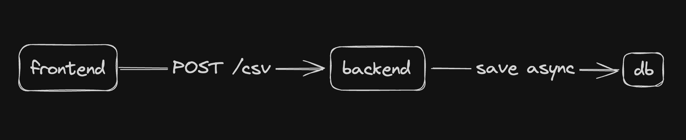

# CSV Upload

Application available on
https://challenge-nath-csv.vercel.app/

## Docs

[Server](./server/Readme.md)
[Web](./web/README.md)

## Running locally

1 - Initialize Docker

2 - Run the script

```bash
bash init.sh
```

3 - Run the server

```bash
cd ./server npm run dev
```

running on localhost:3001

4 - Run the web

```bash
cd ./web npm run dev
```

running on localhost:3000

## Testing application

The application only contains unit test to adapter on server. If like to use the application, can use the .csv files to do upload.

## Architeture

- The CSV was upload in sync mode
- The backend returns a response
- The data are savend in database async

  
